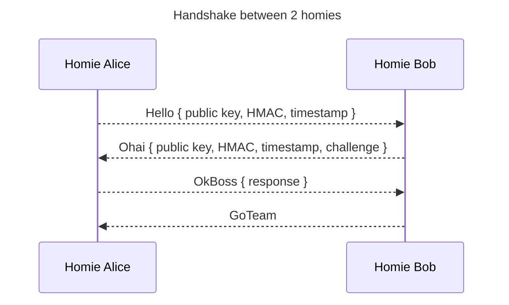
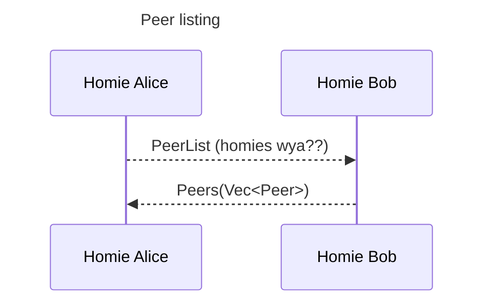
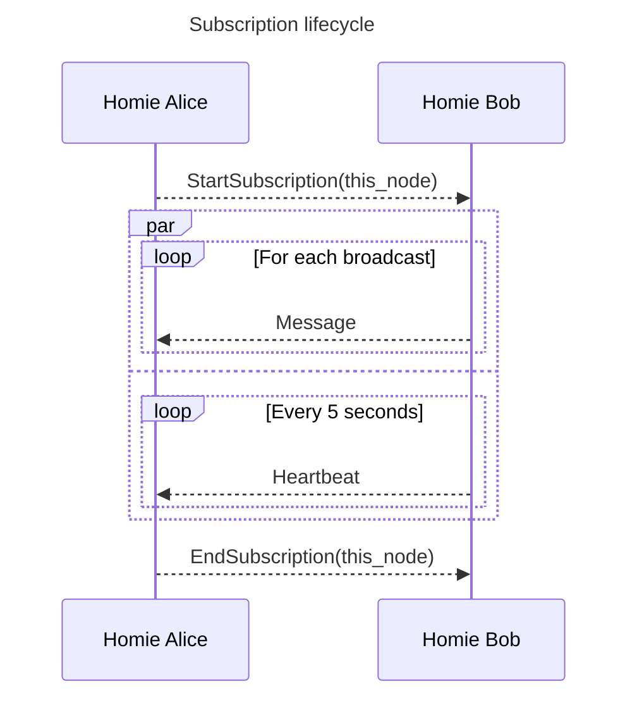
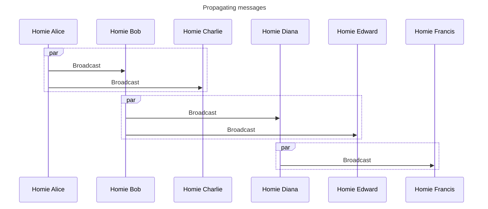

# Gwyh protocol

This document describes the protocol used by gwyh. Gwyh uses an efficient gossip
protocol to disseminate message to all nodes (homies) in a cluster as quickly as possible
while minimizing chatter and amplification.

Messages are broadcasted to each homie's assigned list of active peers. Messages
are sent best-effort, without any acknowledgement, and large messages (which
require multiple packets to deliver) are split using a sliding window to
reassemble them. Insanely large messages (i.e., those which would fill all the
memory on a computer) are not recommended with gwyh.

We do not use acks in gwyh at the protocol level, and we don't guarantee
delivery, but you can (if you wish) layer your own acks on top of gwyh by simply
replying to broadcasts with an acknowledgement. Keep in mind, however, this can
create a flood of packets which might have unintended consequences. Some
networking stacks will drop UDP packets when buffers are full, which can lead to
strange problems if not handled correctly. Broadcasts are forwarded to every
peer in a cluster multiplied by the number of subscribed peers per node.

There is an exception, however, to the "we don't use acks" rule: broadcasts that
exceed the 64KiB boundary of a UDP packet are framed and transmitted with a
sliding window, with reasonably reliable (but not guaranteed) delivery.

## Wire protocol

Gwyh's protocol is UDP-based, with messages encoded in
[MessagePack](https://msgpack.org/) format.

MessagePack, as opposed to JSON (or some other format), was chosen for its
compact representation, inspectability (using tools like Wireshark),
and for being schemaless.

Messages are authenticated and encrypted. A pre-shared key is used during the
initial handshake to establish distinct ephemeral keys for communication between
any 2 peers, using public key authenticated cryptography. We use X25519 for key
derivation, XSalsa20 as a stream cipher, Poly1305 for message authentication,
and Blake2b for the handshake HMAC.

Gwyh uses an
[AIMD](https://en.wikipedia.org/wiki/Additive_increase/multiplicative_decrease)-based
congestion control algorithm, based on the one described by the [UDT
protocol](https://en.wikipedia.org/wiki/UDP-based_Data_Transfer_Protocol). As
gwyh's protocol is ack-less, we instead use naks exclusively to measure
deliverability and estimate transmission rates. Under normal circumstances, the
sending delay between packets will trend toward zero provided the network is
congestion-free.

## Initial handshake

When a homie joins a cluster, it needs to request the list of known peers from
the bootstrap peers, but it cannot do this until after a handshake. The
handshake involves a challenge and response authentication process. Each homie in
the cluster must have at least one matching pre-shared key (you can specify
multiple keys to support key rotation).

The challenge/response never transmits the pre-shared keys directly over the
wire.  Instead, homies exchange a time-locked HMAC, and also perform a
challenge/response. The handshake is performed in both directions: the initiator
and receiver both authenticate each other, however only the receiver sends a
challenge to the initiator as a way to prevent replay attacks which might occur
within the 60-second HMAC window.

The handshake consists of 4 steps:

* **Hello**: Alice sends public key and time-locked HMAC to Bob
* **Ohai**: Bob responds with public key, time-locked HMAC, and challenge
* **OkBoss**: Alice responds with response to challenge
* **GoTeam**: Bob responds with an OK, we are now authenticated and can enjoy our lives

The time-locked HMAC is based on Blake2b, which includes a timestamp of the
current time the HMAC was generated. HMACs are valid for +/- 60 seconds from the
time they were created, which helps prevent replay attacks. For extra safety,
the initiator must also respond to a challenge, which stops the possibility of
replay attacks.

Each homie in a cluster must have its clock synchronized within a few seconds, or
else the handshake will fail. As most computers run some form of NTP, this is
not considered to be problematic.

If a homie receives a Hello with an invalid HMAC, the message is ignored, which
limits the possibility of a handshake DDoS. For example, a bad actor cannot
discover homies by simply sending UDP packets randomly. If a bad actor can sniff
packets, they _could_ replay the same Hello and receive a valid Ohai, but they
will fail the OkBoss without the pre-shared key.

## Finding peers (where my homies at???)

After a successful handshake, a new homie will request the list of peers from any
of the bootstrap peers.

## Selecting peers for broadcasting updates

Each homie maintains its own list of known and assigned peers. Assigned peers are
those from which a homie will receive updates broadcasted from. Known peers are
those in the cluster which are known to have been active.

Peers are selected deterministically, by choosing N peers at random from the
list of known peers. All peers in the cluster will request to receive updates
from at N other peers. The value for N is defined by configuration, and a
strategy can be selected (defaulting to uniform random selection).

Individual homies choose which peers to receive updates _from_, rather than
choosing which homies to broadcast updates _to_. This ensures every homie in a
cluster will receive updates from at least N peers.

Any time a peer changes state (UP or DOWN), every homie will perform a delayed
peer reassignment, which will start and end subscriptions as needed.

## Maintaining peer list

A peer is added to the known list of peers once it successfully completes a
handshake and authentication. The peer list will continuously grow in size as
new homies enter the cluster. When a new peer is added, that peer is marked as UP
and broadcasted to the rest of the cluster.

Assigned peers send heartbeats at a fixed interval of 5 second. When 3 
consecutive heartbeats are missed, a peer is marked as DOWN, and removed across
the cluster.

A peer marked down can reconnect to the cluster by successfully handshaking with
any other peer.

## Broadcasting messages

A homie must subscribe to broadcasts from another peer before receiving any
broadcasts. Before a homie can send a broadcast, it must have peers subscribed
to it. Once a subscription is established, a heartbeat is sent every 5 seconds
to make sure the peer is happy, alive, and well. If a heartbeat is missed 3
times, that peer is marked as down and removed from the peer list.

Broadcasts are forwarded to all of a homie's subscribed peers immediately, but
only for messages that haven't been seen recently. An LRU cache is used to keep
track of distinct message identifiers. If a homie receives a message with an ID
that has already been seen, the message is simply ignored rather than forwarded
along.

